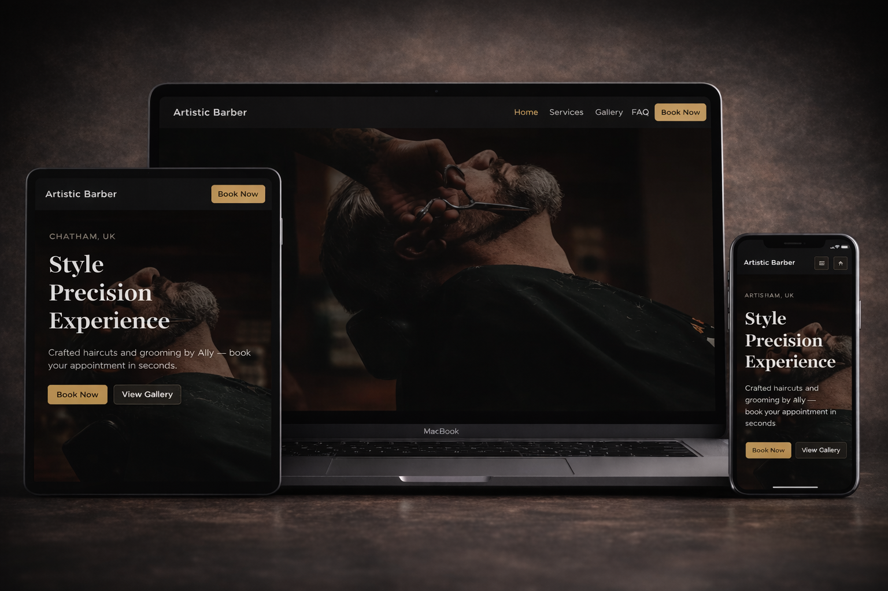
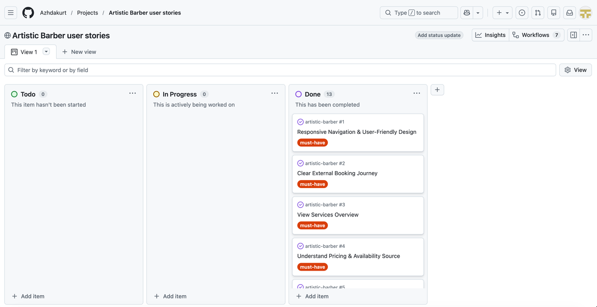
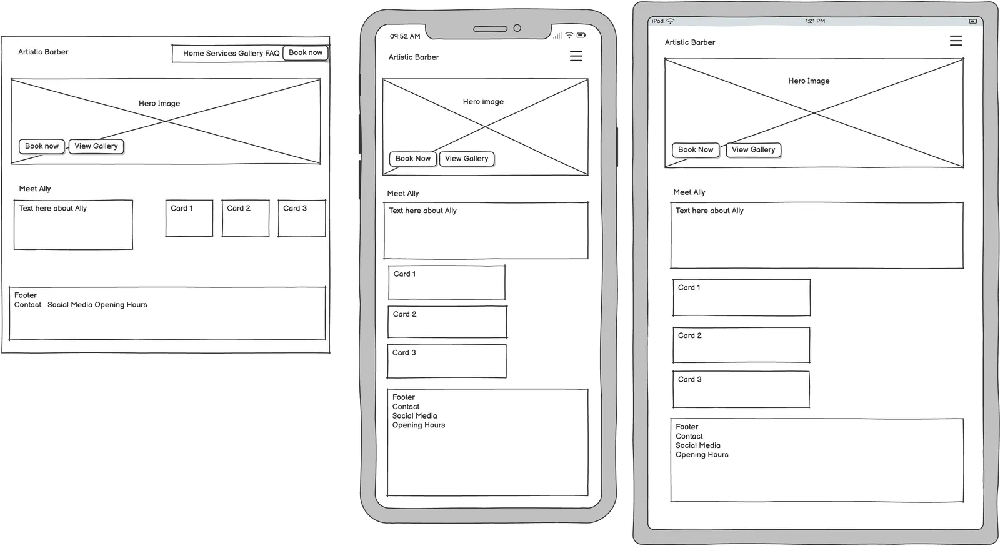
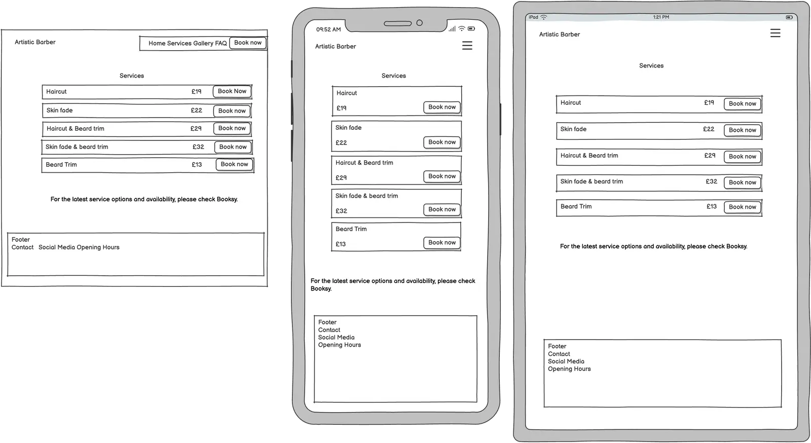

# Artistic Barber

Live Site: https://azhdakurt.github.io/artistic-barber/

---

## Introduction

This website has been created for **Artistic Barber – Ally**, a professional barber based in Chatham, UK. The purpose of this project is to provide a modern, user-friendly, and visually appealing online presence that clearly presents services, pricing, and booking options while reflecting the professionalism and craftsmanship of the brand.

The website serves both as an informational platform and a practical tool for clients, allowing them to view services, explore a gallery of work, find answers to common questions, and access external booking via Booksy. It has been designed with a clean, minimal aesthetic to ensure a seamless user experience across all devices.

This project demonstrates my skills in front-end development, responsive design, accessibility considerations, and user-centered design principles.

---

---

## Table of Contents

1. [Introduction](#introduction)

2. [Project Goals](#project-goals)
   - [User Goals](#user-goals)
   - [Site Owner Goals](#site-owner-goals)

3. [User Experience (UX)](#user-experience-ux)
    - [Strategy Plane](#strategy-plane)
    - [Scope Plane](#scope-plane)
    - [Structure Plane](#structure-plane)
    - [Skeleton Plane](#skeleton-plane)
    - [Surface Plane](#surface-plane)
   - [User Stories](#user-stories)
     - [First-Time Visitor Stories](#first-time-visitor-stories)
     - [Returning Visitor Stories](#returning-visitor-stories)
     - [Site Owner Stories](#site-owner-stories)

4. [Design](#design)
   - [Colour Scheme](#colour-scheme)
   - [Typography](#typography)
   - [Structure](#structure)
   - [Wireframes](#wireframes)

5. [Technologies Used](#technologies-used)
   - [Languages](#languages)
   - [Frameworks & Libraries](#frameworks--libraries)

6. [Wireframes](#wireframes)
   - [Home Page](#home-page)
   - [Services Page](#services-page)
   - [Gallery Page](#gallery-page)
   - [FAQ Page](#faq-page)
   - [404 Page](#404-page)

7. [Features](#features)
   - [Navbar](#navbar)
   - [Hero Section (Home)](#hero-section-home)
   - [Services Page](#services-page)
   - [Gallery Page](#gallery-page)
   - [FAQ Page](#faq-page)
   - [Footer](#footer)
   - [404 Page](#404-page)

8. [Testing](#testing)
   - [HTML Validation](#html-validation)
   - [CSS Validation](#css-validation)
   - [Accessibility](#accessibility)
   - [Performance](#performance)
   - [Device Testing](#device-testing)
   - [Browser Compatibility](#browser-compatibility)

9. [Bugs & Fixes](#bugs--fixes)

10. [Deployment](#deployment)

11. [Credits](#credits)
    - [Images](#images)
    - [Tools & Resources](#tools--resources)

12. [Acknowledgements](#acknowledgements)

---

## Project Goals

The primary goal of this project is to create a professional, user-friendly, and accessible website for **Artistic Barber – Ally** that clearly presents services, pricing, and booking options while reflecting the quality and professionalism of the brand.

The website aims to:

- Provide a clear and intuitive online presence for the business.  
- Make it easy for users to understand what services are offered and at what cost.  
- Enable seamless access to external booking via Booksy.  
- Showcase examples of work through a curated gallery.  
- Address common customer questions proactively through an FAQ section.  
- Ensure a responsive and accessible experience across different devices and browsers.

---

## User Goals

As a user of the website, I want to:

- Quickly understand who Ally is and what services are offered.  
- Easily view service options and pricing before booking.  
- Access booking via Booksy without confusion or friction.  
- Browse a gallery of previous work to assess style and quality.  
- Find clear contact information and opening hours.  
- Get answers to common questions through the FAQ page.  
- Navigate the website smoothly on both mobile and desktop devices.

---

## Site Owner Goals

As the site owner, the goals of the website are to:

- Establish a professional and trustworthy online presence for Artistic Barber.  
- Clearly present services and pricing to reduce unnecessary inquiries.  
- Direct users efficiently to Booksy for booking management.  
- Showcase Ally’s skills and experience through a visual gallery.  
- Reduce repetitive questions by providing clear information in the FAQ section.  
- Ensure that users can always return to the homepage easily via a custom 404 page.

---

## User Experience (UX)

### Strategy Plane

The primary goal of the website is to present Artistic Barber as a professional, modern, and trustworthy brand while making it easy for users to view services, pricing, and book appointments. The target audience includes current and potential clients who value quality grooming services and a smooth digital experience.

The website aligns with user needs by providing clear navigation, transparent pricing, visual examples of work, and quick access to booking and contact information.

---

### Scope Plane

The website includes the following core features:

**Must-have features:**
- A clear homepage introducing Artistic Barber and Ally  
- Services page with transparent pricing  
- External booking via Booksy  
- Responsive design for all devices  
- Contact details and opening hours in the footer   

**Should-have features:**
- Gallery showcasing recent work  
- FAQ section addressing common questions  

**Could-have features:**
- Custom 404 page 

**Future improvements:**
- Contact form for general inquiries  
- Lightbox image preview in the gallery  
- Online chat or booking integration within the site  

---

### Structure Plane

The website is structured as follows:

- **Home:** Introduction to Artistic Barber and Ally  
- **Services:** List of services with pricing and booking links  
- **Gallery:** Visual showcase of previous work  
- **FAQ:** Answers to common customer questions  
- **404:** Custom error page with clear navigation back to the homepage  

Navigation is consistent across all pages via a fixed navbar and footer.

---

### Skeleton Plane

The layout is clean and structured using Bootstrap’s grid system. Key elements such as the navbar, hero section, service list, and footer are placed consistently across pages.

The design prioritizes readability, clear hierarchy, and ease of navigation on both mobile and desktop devices.

---

### Surface Plane

The visual design follows a minimal, modern aesthetic with a dark navbar and footer, complemented by an accent gold color for primary buttons.

---

## User Stories

User stories were planned and tracked using a Kanban-style board (Todo → In Progress → Done) to ensure a structured, user-centred development process.

Below is an overview of the completed Must-Have user stories:

---

### First-Time Visitor Stories

#### 1) Responsive Navigation & User-Friendly Design (Must-have)

**User Story**  
As a First-Time Visitor, I need easy navigation and a user-friendly design, including a responsive layout for my device, so I can find information quickly and efficiently without frustration.

**Acceptance Criteria**
- The website is fully responsive across various devices and screen sizes.  
- Navigation is consistent across all pages.  
- The active page is clearly indicated in the navigation.  
- All navigation links work and do not lead to broken pages.  

**Tasks**
- Build a responsive Bootstrap navbar with links to Home, Services, Gallery, FAQ.  
- Add a “Book Now” CTA button in the navbar linking to Booksy (opens in new tab).  
- Apply Bootstrap grid/utility classes and custom media queries where needed.  
- Test layout on mobile, tablet, and desktop screen widths.  

---

#### 2) Clear External Booking Journey (Must-have)

**User Story**  
As a user, I want to clearly see how to book an appointment, so I can schedule a service quickly using a trusted platform.

**Acceptance Criteria**
- “Book Now” is visible on every page (navbar + key page sections).  
- Clicking “Book Now” opens the Booksy booking page in a new tab.  
- Copy on the site explains that bookings are handled via Booksy.  

**Tasks**
- Add Book Now buttons to Home hero, Services page, Gallery page, FAQ page.  
- Configure all external booking links with `target="_blank"` and `rel="noopener"`.  
- Add short supporting text on Services/FAQ indicating availability/pricing handled on Booksy.  

---

#### 3) View Services Overview (Must-have)

**User Story**  
As a user, I want to view an overview of services, so I can understand what Ally offers before booking.

**Acceptance Criteria**
- Services page lists key services.  
- Services page includes a note directing users to Booksy for full pricing and real-time availability.  
- Services page includes a clear “Book Now” button.  

**Tasks**
- Create `services.html` with 3–6 service sections (haircuts, beard trim, grooming, etc.).  
- Add a Booksy note and link.    

---

#### 4) Understand Pricing & Availability Source (Must-have)

**User Story**  
As a user, I want to know where pricing and availability information is maintained, so I’m not confused about costs or time slots.

**Acceptance Criteria**
- The website clearly states that pricing and availability are shown on Booksy.  
- Users can access Booksy from Services and FAQ without searching.  

**Tasks**
- Add a pricing/availability message on Services and relevant FAQ answers.   

---

#### 5) Learn About Ally for Trust (Must-have)

**User Story**  
As a user, I want to read about Ally’s background and experience, so I can feel confident booking with him.

**Acceptance Criteria**
- Homepage includes a “Meet Ally” section with real, site-specific content.  
- The section is easy to find and readable on mobile and desktop.  

**Tasks**
- Add “Meet Ally” to the homepage.  
- Include “Why Choose Me” highlights under/near the section.  
- Ensure proper heading structure (H2/H3) and spacing for readability.  

---

#### 6) See Work Examples Before Booking (Must-have)

**User Story**  
As a user, I want to see examples of Ally’s work, so I can judge the quality before booking.

**Acceptance Criteria**
- Gallery page displays a grid of images.  
- Images are optimised for web performance and have descriptive alt text.  
- Gallery page includes a “Visit Instagram” button.  

**Tasks**
- Create `gallery.html` with responsive image grid.  
- Add mixed images (Ally face-not-visible + stock) and write alt text.  
- Optimise images (resize/compress) and confirm they load quickly.  

---

### Returning Visitor Stories

#### 7) Easily Find Location Info (Must-have)

**User Story**  
As a user, I want to quickly find where Ally is based, so I can confirm the general location before booking.

**Acceptance Criteria**
- Homepage includes a short location teaser (e.g., “Based in Chatham”).  
- Footer includes location details on every page.  

**Tasks**
- Add “Based in Chatham” teaser section on homepage.  
- Add location line in the footer across all pages.  

---

#### 8) Access Contact Details Anytime (Must-have)

**User Story**  
As a user, I want to access contact details from any page, so I can reach Ally easily if I have a question.

**Acceptance Criteria**
- Footer is present on all pages.  
- Footer includes WhatsApp/phone, email and icons.  
- Footer includes social media link(s).  

**Tasks**
- Build a consistent footer component across all pages.  
- Add WhatsApp/phone and email icons and Instagram link. 
- Ensure icons/links are accessible.  

---

#### 9) View Opening Days & Hours (Should-have)

**User Story**  
As a user, I want to view general opening days and hours, so I know when Ally typically operates.

**Acceptance Criteria**
- Footer includes opening days/hours in a clear readable format.  
- A note indicates users should check Booksy for real-time availability.  

**Tasks**
- Add an “Opening Hours” section in the footer.  
- Add the note: “Please check availability on Booksy for bookings.”  
- Ensure the footer remains readable on mobile.  

---

#### 10) Get Answers via FAQ (Should-have)

**User Story**  
As a user, I want to read frequently asked questions, so I can quickly resolve common queries before booking.

**Acceptance Criteria**
- FAQ page contains at least 5 relevant questions and answers.  
- Answers relating to booking/pricing direct users to Booksy.  
- FAQ page includes a WhatsApp CTA.  

**Tasks**
- Create `faq.html` with Q&A sections (accordion optional).  
- Add Booksy references where appropriate.  
- Add WhatsApp button.  

---

### Site Owner Stories

#### 11) Friendly 404 Recovery (Could-have)

**User Story**  
As a user, I want a clear 404 page, so I can quickly recover if I enter a wrong URL.

**Acceptance Criteria**
- 404 page displays a helpful message.  
- Includes a button/link back to the Homepage.  
- Keeps consistent navigation/footer styling.  

**Tasks**
- Create `404.html` with message + “Back to Homepage” button.  
- Ensure navbar + footer are included.  
- Test by visiting a non-existent URL in the deployed site.  

---

#### 12) Consistent Branding with Custom Fonts (Must-have)

**User Story**  
As a user, I want the website to use consistent and readable typography, so that the content is easy to read and the brand feels professional.

**Acceptance Criteria**
- A custom font is used consistently across the website.  
- Fonts are loaded via external links (e.g. Google Fonts).  
- A suitable fallback font is defined in case the external font fails to load.  
- Text remains readable across all screen sizes.  

**Tasks**
- Select an appropriate Google Font that matches the brand identity.  
- Add the external font link to the `<head>` section of all pages.  
- Define `font-family` rules in the main CSS file with fallback fonts.  
- Test text readability on mobile, tablet, and desktop devices.  

---

#### 13) Visual Brand Identity with Favicon (Should-have)

**User Story**  
As a user, I want to see a favicon in the browser tab, so that the website is easy to recognise and looks professional.

**Acceptance Criteria**
- A favicon is displayed in the browser tab.  
- The favicon matches the website’s branding.  
- The favicon loads correctly across modern browsers.  

**Tasks**
- Create or select a favicon image matching the brand.  
- Add favicon files to the project assets.  
- Link the favicon in the `<head>` section using appropriate `<link>` tags.  
- Test favicon display in different browsers.  

---

## Design

### Colour Scheme

The colour palette for the **Artistic Barber** website was chosen to reflect a modern, refined, and professional barber brand aesthetic while ensuring good readability, contrast, and visual hierarchy.

| Colour | Hex Code | Usage |
|--------|----------|-------|
| Dark | `#0f0f0f` | Primary background and main brand tone |
| Surface | `#161616` | Secondary background and content containers |
| Border | `#2a2a2a` | Dividers, subtle outlines, and separation |
| Muted | `#cfcfcf` | Secondary text and supporting elements |
| Light | `#f5f5f5` | Backgrounds and high-contrast areas |
| Accent (Gold/Bronze) | `#b08d57` | Primary call-to-action buttons and highlights |

These colours were selected to:
- Create a clean and minimal visual style  
- Support strong contrast and accessibility  
- Maintain a consistent brand identity across all pages  

### Additional Colour Variations  

Slight variations of the main palette were used for improved readability and interaction states, including:
- A slightly darker text colour (`#111`) for enhanced contrast and legibility.  
- A darker shade of the accent colour (`#b8923f`) used for button hover states to provide clear visual feedback to users.

---

### Typography 

The typography for the **Artistic Barber** website was chosen to balance readability, accessibility, and a refined, professional aesthetic that suits a premium barber brand.

| Font | Source | Usage |
|------|--------|-------|
| Playfair Display | Google Fonts | Headings (H1–H6) |
| Inter | Google Fonts | Body text and general content |
| System sans-serif | System default | Fallback for accessibility and performance |

These fonts were chosen to:
- Create a clear visual hierarchy between headings and body text  
- Enhance readability across different devices and screen sizes  
- Support a modern yet refined brand identity

---

### Structure

The website consists of the following pages:

- Home  
- Services  
- Gallery  
- FAQ  
- 404  

---

## Technologies Used 

### Languages  
- **HTML5** – Used to structure the content and layout of the website.  
- **CSS3** – Used for styling, layout customisation, and visual design.  

### Frameworks & Libraries  
- **Bootstrap 5** – Used for the responsive grid system, layout structure, and UI components such as the navbar, buttons, spacing, and utilities.  

### Tools & Platforms  
- **Git** – Version control for tracking changes in the project.  
- **GitHub** – Used to store the repository and deploy the site via GitHub Pages.  
- **VS Code** – Code editor and development environment.  
- **Google Fonts** – Used to import and implement custom typography (Playfair Display and Inter).  
- **Font Awesome** – Used for icons in navigation, buttons, and social links.  
- **Favicon.io** – Used to generate the website favicon.  
- **Balsamiq** – Used to create wireframes and plan the user interface.  
- **TinyPNG / Squoosh** – Used to optimise images for performance.  
- **Google Chrome DevTools (Lighthouse)** – Used for performance, accessibility, and best practice testing.  
- **W3C HTML Validator** – Used to validate HTML code.  
- **W3C CSS Validator (Jigsaw)** – Used to validate CSS code.
- **ChatGPT** – Help with code logic, explanations.   

---

## Wireframes
### Home page

### Services page

### Gallery page
### FAQ page
### 404

---

## Features

### Navbar
- Responsive navigation bar present on all pages  
- Includes links to Home, Services, Gallery, and FAQ  
- “Book Now” button linking to Booksy  
- Active state highlights the current page  

### Hero Section (Home)
- Full-width background image  
- Clear headline and call-to-action buttons  
- “Book Now” and “View Gallery” options  

### Services Page
- Clear list of services with pricing  
- Mobile-friendly layout  
- Direct booking links to Booksy  

### Gallery Page
- Responsive 3-column image grid  
- Optimized images for performance  
- Clickable images opening in a new tab  

### FAQ Page
- Accordion-style frequently asked questions  
- WhatsApp contact button for further inquiries  

### Footer
- Contact details  
- Social media links  
- Opening hours  
- Present on all main pages  

### 404 Page
- Custom error page  
- Clear navigation back to the homepage  

---

## Testing

### HTML Validation
- All pages validated using W3C Markup Validation Service.

### CSS Validation
- CSS validated using W3C Jigsaw CSS Validation Service.

### Accessibility
- Tested using WAVE WebAIM tool — no critical issues found.

### Performance
- Tested using Google Lighthouse in Chrome DevTools.

### Browser Compatibility
- Tested on:
  - Google Chrome  
  - Safari  
  - Mozilla Firefox  

---

## Bugs & Fixes

| Bug | Fix |
|-----|-----|
| Gallery images appeared distorted | Used `object-fit: cover` and consistent aspect ratio |
| Navbar active state not updating | Assigned the `active` class manually on each page’s corresponding navigation link |
| Favicon not showing on GitHub Pages | Corrected file paths by removing leading `/` |

---

## Deployment

This website was deployed using GitHub Pages:

1. Navigate to the repository on GitHub  
2. Go to **Settings → Pages**  
3. Set source to **Branch: main** and folder to **/ (root)**  
4. Save and wait for deployment  

Live site: https://azhdakurt.github.io/artistic-barber/

---

## Credits

### Images
- Stock images from Unsplash and Pexels  
- Hero image by Allef Vinicius on Unsplash  

### Tools & Resources
- Bootstrap Documentation  
- Google Fonts  
- Font Awesome  
- Favicon Generator  

---

## Acknowledgements

- Code Institute course materials  
- Online tutorials and documentation  
- Support and feedback from peers and mentors  

---
